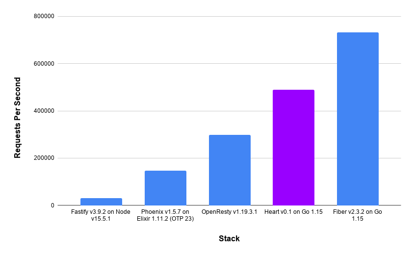

# Heart 💜

A high performance Lua web server with a simple, powerful API. See the full documentation [here](https://heart.hyperspacelogistics.com/).

## Check out [redbean](https://redbean.dev/)!

If you like Heart then you'll probably love redbean. It's a very similar concept but arguably executed and documented better. 

## Overview

Heart combines Go's [fasthttp](https://github.com/valyala/fasthttp) with [LuaJIT](https://luajit.org/)
to create an insanely fast Lua web server.

It also comes with a performant key-value store API backed by [BadgerDB](https://github.com/dgraph-io/badger)
that can store data both in memory and on disk.

## Features

- High throughput
- Low latency
- Fast K/V store
- Versioned API
- Stable Lua 5.1 VM
- Structured logs

## Getting Started

- Create a Lua file that uses the Heart API

```Lua
-- main.lua
local app = require('heart.v1')

app.get('/:name', function(ctx)
  return 'Hello, ' .. ctx.pathParam('name') .. '!'
end)
```

- Run Heart with Docker and point it at your Lua `docker run -v $(pwd):/root/app -p 3333:3333 hyperspacelogistics/heart:latest app/main.lua`
- `curl localhost:3333/world` to see the result
- Congratulations you're running a wicked fast Lua server 🎊

## Benchmark



Each stack was tasked with rendering `{"hello": "world"}` through their JSON stack in production mode, if applicable, with logging disabled.
[wrk](https://github.com/wg/wrk) was used with the command `wrk -t32 -c512 -d30s http://localhost:3333`.
All benchmarks were performed on a CPU-optimized DigitalOcean droplet that had 32vCPUs and 64 GB of RAM.

## Caveats

Global state, like with any parallel web server, is highly discouraged. For performance reasons Heart keeps a
pool of Lua state to reuse in subsequent requests. State is reused in a random order and therefore global state that
is modified in requests is functionally random in Heart. Be cautious! Static global state is the exception
and can generally be treated as safe.
